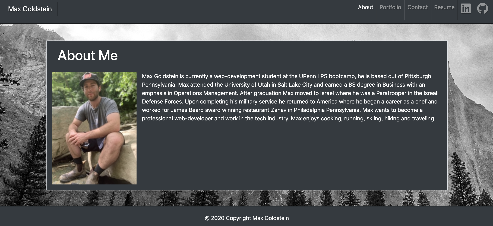
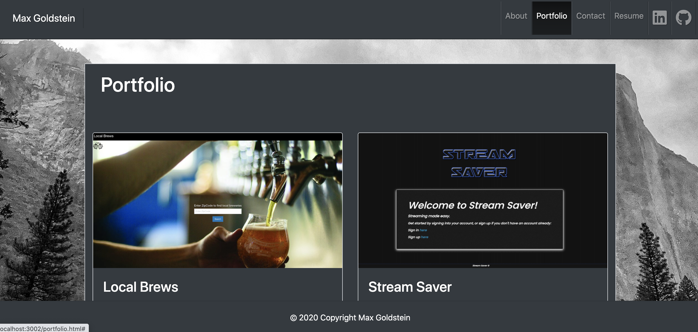
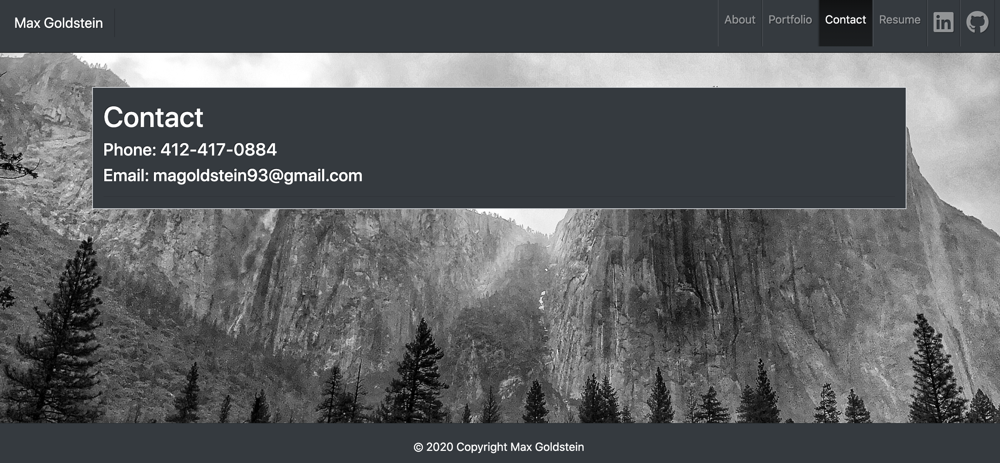

# Max Goldstein Portfolio

[CLICK HERE FOR LIVE APPLICATION](https://maxgoldstein93.github.io/userDirectory/)

## Table of Contents
* [Screenshots](#screenshots)

* [Application Description](#application-description)

* [Built With](#built-with)

* [License](#license)

* [Questions](#questions)

## Screenshots 

## Application Description
I created this project as an assignment but quickly made it my own. This website is my own personal portfolio. It has a short bio, a portfolio page that will soon be filled with many projects and assignments. And a contact page.
 
I created the website to function and look the way it does because it has my own personal style with the white and gray color scheme with the mountains as the background. I was able to create this web application using react, CSS, Bootstrap and bootswatch. Now that I have built this portfolio I have a place to display my work and look more professional to future employers. 

## Built With
* react.js
* bootstrap
* JavaScript 

## License

Copyright 2020 ©Max Goldstein

Permission is hereby granted, free of charge, to any person obtaining a copy of this software and associated documentation files (the "Software"), to deal in the Software without restriction, including without limitation the rights to use, copy, modify, merge, publish, distribute, sublicense, and/or sell copies of the Software, and to permit persons to whom the Software is furnished to do so, subject to the following conditions:
  
The above copyright notice and this permission notice shall be included in all copies or substantial portions of the Software.
  
THE SOFTWARE IS PROVIDED "AS IS", WITHOUT WARRANTY OF ANY KIND, EXPRESS OR IMPLIED, INCLUDING BUT NOT LIMITED TO THE WARRANTIES OF MERCHANTABILITY, FITNESS FOR A PARTICULAR PURPOSE AND NONINFRINGEMENT. IN NO EVENT SHALL THE AUTHORS OR COPYRIGHT HOLDERS BE LIABLE FOR ANY CLAIM, DAMAGES OR OTHER LIABILITY, WHETHER IN AN ACTION OF CONTRACT, TORT OR OTHERWISE, ARISING FROM, OUT OF OR IN CONNECTION WITH THE SOFTWARE OR THE USE OR OTHER DEALINGS IN THE SOFTWARE.

## Questions

If you have any questions regarding this repo, please contact me via Github or email.

 Max Goldstein
* Github: [maxgoldstein93](https://github.com/maxgoldstein93) 
* Email: <magoldstein93@gmail.com>